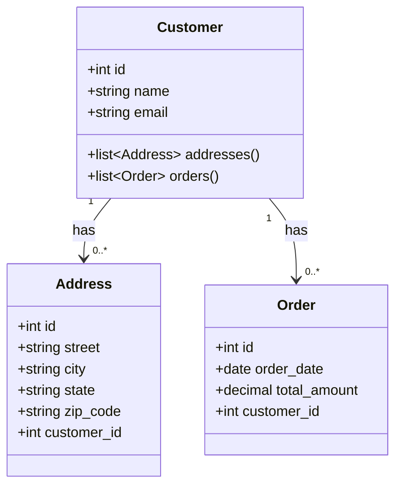

Para este exercício de modelagem de um sistema CRUD, podemos criar um cenário onde temos três modelos: **Customer**, **Address**, e **Order**. Neste cenário, um **Customer** (cliente) pode ter muitos **Addresses** (endereços) e muitos **Orders** (pedidos).

### 1. Modelo Customer

Este modelo representa um cliente. Um cliente pode ter muitos endereços e muitos pedidos.

**Atributos:**

- `id`: Identificador único do cliente (Integer, PK)
- `name`: Nome do cliente (String)
- `email`: Email do cliente (String)

### 2. Modelo Address

Este modelo representa um endereço. Um endereço pertence a um cliente.

**Atributos:**

- `id`: Identificador único do endereço (Integer, PK)
- `street`: Rua do endereço (String)
- `city`: Cidade do endereço (String)
- `state`: Estado do endereço (String)
- `zip_code`: Código postal do endereço (String)
- `customer_id`: Identificador do cliente ao qual o endereço pertence (Integer, FK)

### 3. Modelo Order

Este modelo representa um pedido. Um pedido pertence a um cliente.

**Atributos:**

- `id`: Identificador único do pedido (Integer, PK)
- `order_date`: Data do pedido (Date)
- `total_amount`: Valor total do pedido (Decimal)
- `customer_id`: Identificador do cliente ao qual o pedido pertence (Integer, FK)

### Diagrama de Relacionamentos


```plaintext
Customer (1) ---- (N) Address
      |
      |
      +---- (N) Order
```

### Operações CRUD

#### Customer

1. **Create**: Criar um novo cliente.

   - Exemplo de endpoint: `POST /customers`
   - Dados: `{ "name": "John Doe", "email": "john.doe@example.com" }`
2. **Read**: Ler detalhes de um cliente específico.

   - Exemplo de endpoint: `GET /customers/{id}`
   - Resposta: `{ "id": 1, "name": "John Doe", "email": "john.doe@example.com" }`
3. **Update**: Atualizar informações de um cliente.

   - Exemplo de endpoint: `PUT /customers/{id}`
   - Dados: `{ "name": "John Doe", "email": "john.doe@newdomain.com" }`
4. **Delete**: Deletar um cliente.

   - Exemplo de endpoint: `DELETE /customers/{id}`

#### Address

1. **Create**: Criar um novo endereço.

   - Exemplo de endpoint: `POST /addresses`
   - Dados: `{ "street": "123 Main St", "city": "Anytown", "state": "CA", "zip_code": "12345", "customer_id": 1 }`
2. **Read**: Ler detalhes de um endereço específico.

   - Exemplo de endpoint: `GET /addresses/{id}`
   - Resposta: `{ "id": 1, "street": "123 Main St", "city": "Anytown", "state": "CA", "zip_code": "12345", "customer_id": 1 }`
3. **Update**: Atualizar informações de um endereço.

   - Exemplo de endpoint: `PUT /addresses/{id}`
   - Dados: `{ "street": "456 Elm St", "city": "Newtown", "state": "NY", "zip_code": "54321" }`
4. **Delete**: Deletar um endereço.

   - Exemplo de endpoint: `DELETE /addresses/{id}`

#### Order

1. **Create**: Criar um novo pedido.

   - Exemplo de endpoint: `POST /orders`
   - Dados: `{ "order_date": "2023-05-26", "total_amount": 150.00, "customer_id": 1 }`
2. **Read**: Ler detalhes de um pedido específico.

   - Exemplo de endpoint: `GET /orders/{id}`
   - Resposta: `{ "id": 1, "order_date": "2023-05-26", "total_amount": 150.00, "customer_id": 1 }`
3. **Update**: Atualizar informações de um pedido.

   - Exemplo de endpoint: `PUT /orders/{id}`
   - Dados: `{ "order_date": "2023-05-27", "total_amount": 200.00 }`
4. **Delete**: Deletar um pedido.

   - Exemplo de endpoint: `DELETE /orders/{id}`


# Diagrama de Casos de Uso


Claro! Aqui está um diagrama de caso de uso usando Mermaid para o sistema com as entidades **Customer**, **Address**, e **Order**. Este diagrama mostrará os principais casos de uso (ações) para o sistema e os atores (usuários ou sistemas externos) que interagem com ele.

```mermaid
%%{init: {'theme': 'base', 'themeVariables': { 'primaryColor': '#FF5733', 'edgeLabelBackground':'#FFEBCD', 'actorBorder':'#FF5733', 'actorTextColor': '#000'}}}%%
usecaseDiagram
    actor Admin as "Admin"
    actor Customer as "Customer"
  
    Admin --> (Manage Customers)
    Admin --> (Manage Addresses)
    Admin --> (Manage Orders)
  
    Customer --> (View Profile)
    Customer --> (Update Profile)
    Customer --> (Add Address)
    Customer --> (Place Order)
    Customer --> (View Orders)
  
    (Manage Customers) --> (Create Customer)
    (Manage Customers) --> (Read Customer)
    (Manage Customers) --> (Update Customer)
    (Manage Customers) --> (Delete Customer)
  
    (Manage Addresses) --> (Create Address)
    (Manage Addresses) --> (Read Address)
    (Manage Addresses) --> (Update Address)
    (Manage Addresses) --> (Delete Address)
  
    (Manage Orders) --> (Create Order)
    (Manage Orders) --> (Read Order)
    (Manage Orders) --> (Update Order)
    (Manage Orders) --> (Delete Order)

```

**Atores**:

- - **Admin**: Representa um administrador do sistema que pode gerenciar clientes, endereços e pedidos.
  - **Customer**: Representa um cliente que pode interagir com seu próprio perfil, endereços e pedidos.
- **Casos de Uso**:

  - **Admin**:
    - **Manage Customers**: Inclui criar, ler, atualizar e deletar clientes.
    - **Manage Addresses**: Inclui criar, ler, atualizar e deletar endereços.
    - **Manage Orders**: Inclui criar, ler, atualizar e deletar pedidos.
  - **Customer**:
    - **View Profile**: O cliente pode visualizar seu perfil.
    - **Update Profile**: O cliente pode atualizar seu perfil.
    - **Add Address**: O cliente pode adicionar novos endereços.
    - **Place Order**: O cliente pode fazer novos pedidos.
    - **View Orders**: O cliente pode visualizar seus pedidos.

Este diagrama de caso de uso oferece uma visão geral das interações principais entre os usuários do sistema (admin e clientes) e as funcionalidades que o sistema oferece.


# Diagrama de Classes



### Implementação Exemplo (usando um framework como Django)

```python
from django.db import models

class Customer(models.Model):
    name = models.CharField(max_length=100)
    email = models.EmailField()

class Address(models.Model):
    street = models.CharField(max_length=255)
    city = models.CharField(max_length=100)
    state = models.CharField(max_length=100)
    zip_code = models.CharField(max_length=20)
    customer = models.ForeignKey(Customer, on_delete=models.CASCADE, related_name='addresses')

class Order(models.Model):
    order_date = models.DateField()
    total_amount = models.DecimalField(max_digits=10, decimal_places=2)
    customer = models.ForeignKey(Customer, on_delete=models.CASCADE, related_name='orders')
```

Com este modelo, temos um sistema CRUD básico que permite gerenciar clientes, endereços e pedidos, com as relações de um para muitos entre Cliente e Endereço, e entre Cliente e Pedido.
